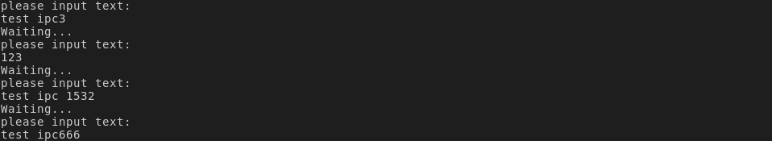
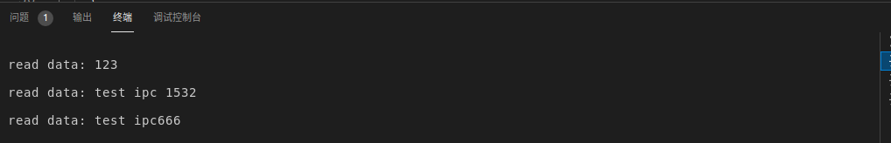

# IPC_ShareMemDemo
**编译命令**

```c
gcc -E hello.c -o hello.i	//预处理

gcc -S hello.i -o hello.s	//编译 现在的编译器将预处理和编译合并为一个步骤了可以直接调用编译命令: gcc -S hello.c -o hello.s

gcc -c hello.s -o hello.o	//汇编

gcc hello.o bb.o -o hello	//链接
    
```

参考博客[Linux进程间通信六](https://www.cnblogs.com/52php/p/5861372.html)

Linux共享内存demo

**1、shmget()函数**

该函数用来创建共享内存，它的原型为：

> int shmget(key_t key, size_t size, int shmflg);

第一个参数，与信号量的semget函数一样，程序需要提供一个参数key（非0整数），它有效地为共享内存段命名，shmget()函数成功时返回一个与key相关的共享内存标识符（非负整数），用于后续的共享内存函数。调用失败返回-1.

不相关的进程可以通过该函数的返回值访问同一共享内存，它代表程序可能要使用的某个资源，程序对所有共享内存的访问都是间接的，程序先通过调用shmget()函数并提供一个键，再由系统生成一个相应的共享内存标识符（shmget()函数的返回值），只有shmget()函数才直接使用信号量键，所有其他的信号量函数使用由semget函数返回的信号量标识符。

第二个参数，size以字节为单位指定需要共享的内存容量

第三个参数，shmflg是权限标志，它的作用与open函数的mode参数一样，如果要想在key标识的共享内存不存在时，创建它的话，可以与IPC_CREAT做或操作。共享内存的权限标志与文件的读写权限一样，举例来说，0644,它表示允许一个进程创建的共享内存被内存创建者所拥有的进程向共享内存读取和写入数据，同时其他用户创建的进程只能读取共享内存。

**2、shmat()函数   -- at：attach**

第一次创建完共享内存时，它还不能被任何进程访问，shmat()函数的作用就是用来启动对该共享内存的访问，并把共享内存连接到当前进程的地址空间。它的原型如下：

> void *shmat(int shm_id, const void *shm_addr, int shmflg);

第一个参数，shm_id是由shmget()函数返回的共享内存标识。

第二个参数，shm_addr指定共享内存连接到当前进程中的地址位置，通常为空，表示让系统来选择共享内存的地址。

第三个参数，shm_flg是一组标志位，通常为0。

调用成功时返回一个指向共享内存第一个字节的指针，如果调用失败返回-1.

**3、shmdt()函数   -- dt：detach**

该函数用于将共享内存从当前进程中分离。注意，将共享内存分离并不是删除它，只是使该共享内存对当前进程不再可用。它的原型如下：

> int shmdt(const void *shmaddr);

参数shmaddr是shmat()函数返回的地址指针，调用成功时返回0，失败时返回-1.

**4、shmctl()函数   -- ctl：control**

与信号量的semctl()函数一样，用来控制共享内存，它的原型如下：

> int shmctl(int shm_id, int command, struct shmid_ds *buf);

第一个参数，shm_id是shmget()函数返回的共享内存标识符。

第二个参数，command是要采取的操作，它可以取下面的三个值 ：

- IPC_STAT：把shmid_ds结构中的数据设置为共享内存的当前关联值，即用共享内存的当前关联值覆盖shmid_ds的值。
- IPC_SET：如果进程有足够的权限，就把共享内存的当前关联值设置为shmid_ds结构中给出的值
- IPC_RMID：删除共享内存段

第三个参数，buf是一个结构指针，它指向共享内存模式和访问权限的结构。

shmid_ds结构 至少包括以下成员：

```c
struct shmid_ds
{
    uid_t shm_perm.uid;
    uid_t shm_perm.gid;
    mode_t shm_perm.mode;
};
```

**结果展示**





